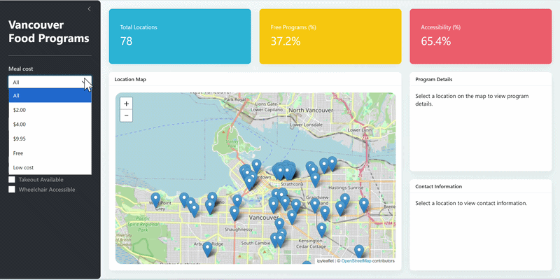

# Vancouver Food Programs Dashboard

This project is a dashboard to help Vancouver residents experiencing food insecurity find free or low-cost food supports (e.g., meal programs and food hampers). Many programs exist, but information can be hard to search and compare. Our dashboard supports practical decision-making by letting users explore programs on a map and filter by service type, cost, and access requirements. We chose the City of Vancouver Food Programs dataset because it includes both program details and geospatial information needed for exploration.

## Demonstration



## Data

The dashboard uses a snapshot of the City of Vancouver “Free and Low-Cost Food Programs” dataset stored in `data/food_program_data.csv`.

## Usage For Contributors

Please follow our contribution rules that are found [here](https://github.com/UBC-MDS/DSCI-532_2026_22_Vancouver-LC_Food-Programs/blob/main/CONTRIBUTING.md). 

Follow these steps to run the dashboard locally on your machine:

1. Clone the repository to your local machine:
   ```bash
   git clone https://github.com/UBC-MDS/DSCI-532_2026_22_Vancouver-LC_Food-Programs.git
    ```
2. Navigate to the project directory:
   ```bash
   cd DSCI-532_2026_22_Vancouver-LC_Food-Programs
   ```
3. Install the environment:
   ```bash
   conda env create -f environment.yml
   ```
4. Activate the environment:
   ```bash
    conda activate vancouver-food-dashboard
    ```
5. Run the app by executing:
   ```bash
   shiny run --reload src/app.py
   ```
6. Open your web browser and navigate [here](http://localhost:8000) to view the dashboard.
