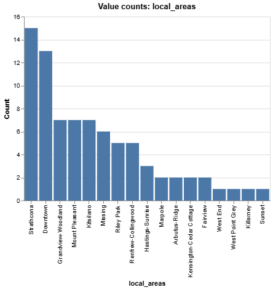
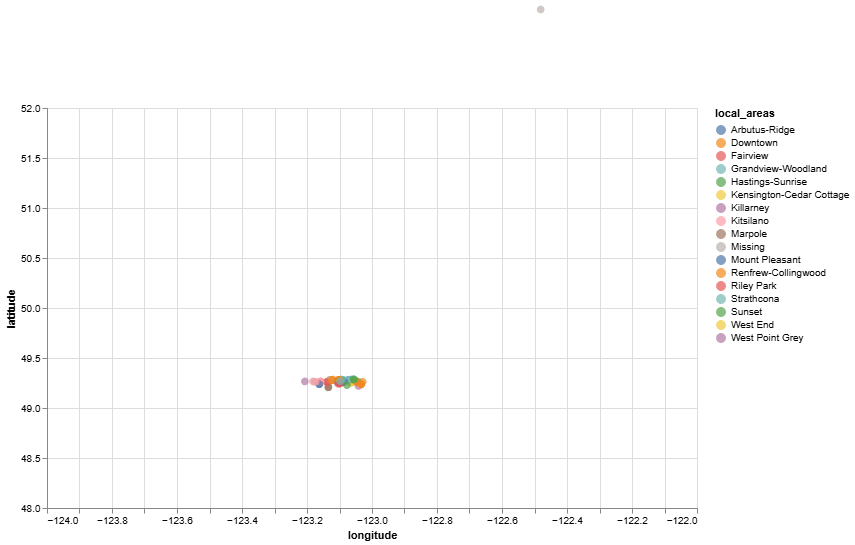
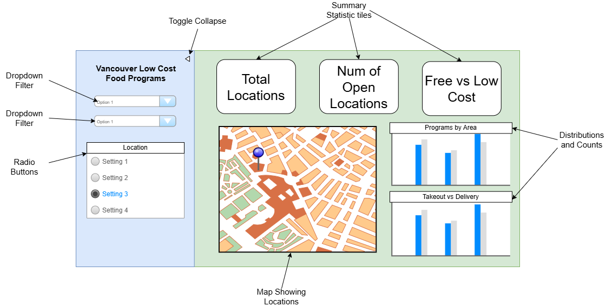

# Vancouver Food Programs Dashboard Proposal

## Motivation and Purpose
> **Target audience:** Vancouver residents experiencing food insecurity
>
> Many residents in Vancouver face challenges accessing affordable and nutritious food due to financial hardship, housing instability, or transportation barriers. Although numerous free and low-cost food programs exist, the available information is often presented in formats that are not easy for residents to navigate. Individuals may struggle to determine which programs are near them, what services are offered, and how to access them. To address this issue, we propose building a user-friendly data visualization dashboard that helps residents quickly identify food programs based on location and service type. By transforming raw data into an accessible and interactive tool, our dashboard aims to improve awareness of available resources and make it easier for residents to connect with the support they need.

## Description of the Data
> We will use the City of Vancouver “Free and Low-Cost Food Programs” dataset, which lists community food supports (e.g., meal programs and food hampers) across Vancouver. Each row represents a program listing at a specific location.

In our current downloaded snapshot, the dataset contains **80 rows** and **26 columns**. Key variables include:
- **Program details** (e.g., `Program Name`, `Organization Name`, `Program Status`, `Description`) to explain what the service is and whether it is currently operating.
- **Service type** (e.g., `Provides Meals`, `Provides Hampers`) to let users filter programs based on what support they need.
- **Location information** (e.g., `Location Address`, `Local Areas`, `Latitude`, `Longitude`) to support map-based exploration and “near me” searching (most records have coordinates).
- **Access constraints** (e.g., `Delivery Available`, `Takeout Available`, `Wheelchair Accessible`) to help users identify feasible options.
- **Affordability** (e.g., `Meal Cost`, `Hamper Cost`) to distinguish free vs low-cost programs.
- **Sign-up/referral requirements** (e.g., `Signup Required`, `Requires Referral`, and contact fields) to clarify what steps are needed before attending.
- **Last updated** (`Last Update Date`) to show how recently program information was refreshed.

Overall, this dataset supports our dashboard goals because it enables users to filter programs by **need (meals vs hampers), feasibility (cost and accessibility), and location (map + local area)**, which directly matches our user stories.

## Research Questions & Usage Scenarios
Usage Scenario

> Diana is a single mother living in Vancouver who often struggles to access affordable and nutritious food. She wants to find nearby free or low-cost food programs that fit her schedule and provide the type of support her family needs. She wants to be able to explore program locations, filter by service type, and identify options that are accessible by transportation.
>
When Diana logs on to our "Vancouver Food Dashboard", she will see a map of all available food programs in Vancouver, along with a summary list including program type, location, hours, and eligibility. She can filter programs by type, wheelchair accessibility or by area of the city. Lena may notice that certain neighborhoods have very few programs and that some programs operate only on specific days, helping her plan her week to access food efficiently.
>
Based on her exploration of the dashboard, Diama can make informed decisions about which programs to visit, plan her route, and even share information with friends or neighbors who might need similar support.

### User Stories

> **User Story 1:**
> As a **resident**, I want to filter food programs by type **(meal service, grocery hamper, food bank)** so that I can quickly find the programs that meet my family’s specific needs.**.
>
> **User Story 2:**
> As a **resident**, I want to see program locations on a map so that I can plan which ones are easiest to get to based on my transportation options.
>
> **User Story 3:**
> As a resident, I want to view the population each program serves (e.g., children, older adults, families, indigenous elders) so that I can find programs that are appropriate for me and my family.

### Jobs to Be Done

> **JTBD 1:**
> **Situation:** When I need to plan meals for the week...
> **Motivation:** ...I want to know which food programs are nearby and open on the days I’m available...
> **Outcome:** ...So I can ensure my family has access to nutritious food without unnecessary travel.
>
> **JTBD 2:**
> **Situation:** When I’m unfamiliar with my neighborhood...
> **Motivation:** ...I want to identify programs within walking distance or accessible via public transit...
> **Outcome:** ...So I can reliably get food without relying on friends or expensive transportation.
>
> **JTBD 3:**
> **Situation:** WWhen I need to compare different food programs...
> **Motivation:** ...I want to filter programs by the population they serve and eligibility requirements...
> **Outcome:** ...So I can choose programs that are suitable for my family’s specific needs.

## Exploratory Data Analysis

As show above, we can see that this data will allow us to filter by local area of Vancouver. This will be helpful for users who want to find the nearest low-cost food program to them. 

From the above image, our dataset will allow us to create an interactive map where we can label each local food program location to aid understanding. 

In our dataset, there are also features that specify whether the food program is wheelchair accessible, free or low-cost, whether a referral is required or not, and whether the program is running or not. This will allow users to filter locations based on their needs. 

## App Sketch & Description

Our dashboard will have a landing page consisting of three main sections. On the left, there will be a sidebar menu with various filtering options, including filters for program type, cost, and location. On the right will be the main content area. The top row will display summary statistics about food programs in Vancouver, such as the total number of programs, average cost, and program status. Below this will be the main visualization area, dominated by a map of Vancouver. The map will include markers showing the locations of food programs, and users can click on a marker to view more information about a program. To the right of the map, there will be graphs and charts displaying counts, trends, and distribution information for the selected food programs.
